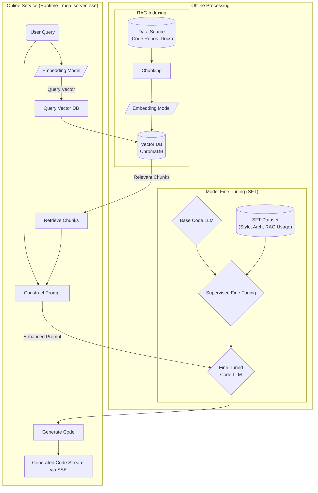

# Code Generator with MCP Integration

## Project Overview

This project aims to build an enterprise-level Python code generator leveraging Large Language Models (LLMs), Retrieval Augmented Generation (RAG), Model Context Protocol (MCP), and other techniques to automatically complete code writing, testing, and deployment. The current phase implements a RAG-based code embedding and semantic search service, supporting communication via the MCP protocol.

This service allows users to process code files, transform them into vector embeddings, and store them in a vector database. It then supports searching for relevant code based on semantic similarity. This enables developers to quickly find code snippets related to specific functionalities or concepts, providing a foundation for subsequent code generation, completion, or understanding.

### Goals

1.  Include a framework for step-by-step ordered code generation (In progress)
2.  Include the ability to integrate historical code (Implemented via RAG)
3.  Include code grading and user grading capabilities (Planned)
4.  Further extend to requirement refinement, technical solution design, code generation and debugging, code operation and deployment (Long-term goal)

## Workflow



## Model Context Protocol (MCP)

This project uses the Model Context Protocol (MCP) for interaction between the client and the server. The following transport methods are currently supported:

1.  **STDIO** (Standard Input/Output): Uses standard input and output streams for communication, suitable for local integration and command-line tools.
2.  **Streamable HTTP**: Uses HTTP long connections (based on Server-Sent Events) and standard HTTP requests (POST/DELETE) for bidirectional streaming communication, suitable for network integration and web applications.

*(The original SSE version has been replaced by Streamable HTTP)*

## Main Components

1.  **Embedding Pipeline (`embedding/`)**: Implements core functionality responsible for loading code, parsing and extracting metadata using AST or Tree-sitter, splitting code blocks, generating vector embeddings, and storing them in the ChromaDB vector database.
2.  **RAG Service (`rag/`)**: Combines Retriever, ReRanker (optional), Prompt Builder, and LLM Interface to process user queries, perform retrieval, optional re-ranking, build prompts, and interact with the LLM to generate responses.
3.  **MCP Server (`mcp/`)**: Exposes the functionality of the Embedding Pipeline and RAG Service as a service via the MCP protocol.
    *   `mcp_server_stdio.py`: STDIO transport version.
    *   `mcp_server_streamablehttp.py`: Streamable HTTP transport version.
4.  **MCP Client (`mcp/`)**: Used to connect to the MCP server and call its tools.
    *   `mcp_client_stdio.py`: Connects to the STDIO server.
    *   `mcp_client_streamablehttp.py`: Connects to the Streamable HTTP server.
5.  **Utilities (`utils/`)**: Provides helper functions such as logging setup.
6.  **Configuration (`config.py`)**: Manages project configurations such as model names, API keys, persistence directories, etc.

## Installation

Requires Python 3.10 or higher.

1.  **Create a virtual environment** (Recommended):
    ```bash
    python -m venv .venv
    source .venv/bin/activate  # Linux/macOS
    # .\.venv\Scripts\activate  # Windows
    ```
2.  **Install dependencies**:
    ```bash
    pip install -r requirements.txt
    ```
    Key dependencies include:
    *   `langchain`, `langchain_community`, `langchain_core`: Core libraries for the RAG process.
    *   `chromadb`: Vector database.
    *   `sentence-transformers`: For embedding models and Cross-Encoder (ReRanker).
    *   `tree-sitter`, `tree-sitter-languages`: Code parsing.
    *   `aiohttp`, `aiohttp-sse-client==0.2.1`: Streamable HTTP transport dependencies.
    *   `openai`, `python-dotenv`: LLM interaction and configuration management.
    *   `pytest`, `pytest-asyncio`: Testing framework.

## Usage

### Streamable HTTP Version (Recommended)

#### Start Streamable HTTP Server

Run from the project root directory (ensure `.venv` is activated):

```bash
python -m mcp.mcp_server_streamablehttp
```

The server will start on port 8080 (default), waiting for client connections.

#### Use Streamable HTTP Client (Programmatic)

```python
import asyncio
from mcp.mcp_client_streamablehttp import StreamableHttpClient

async def main():
    SERVER_URL = "http://localhost:8080"
    TEST_COLLECTION_NAME = "my_code_project"
    # Example file paths (please replace with actual paths)
    # file_paths = ["path/to/your/code.py", "path/to/another/file.py"]
    file_paths = ["embedding/storage/chroma.py", "mcp/transports/streamable_http_client_transport.py"]


    # Create client
    client = StreamableHttpClient(SERVER_URL)

    try:
        # Connect and initialize
        capabilities = await client.initialize()
        print(f"Connected successfully! Server capabilities: {capabilities}")

        # (Optional) Clean up old collection
        print(f"Attempting to clean up collection: {TEST_COLLECTION_NAME}")
        await client.delete_collection(TEST_COLLECTION_NAME)

        # Process code files
        print(f"Processing files: {file_paths}")
        result = await client.process_files(file_paths, TEST_COLLECTION_NAME)
        print(f"Processing result: {result}")
        if result.get("status") != "success":
            print("File processing failed, subsequent steps may not work correctly.")
            return

        # List all collections
        collections = await client.list_collections()
        print(f"Current collections list: {collections}")

        # Get collection info
        info = await client.get_collection_info(TEST_COLLECTION_NAME)
        print(f"Collection '{TEST_COLLECTION_NAME}' info: {info}")

        # Search code
        query = "how to send message via http post"
        print(f"Searching: '{query}'")
        search_results = await client.search_code(query, k=3, collection_name=TEST_COLLECTION_NAME)
        print(f"Number of search results: {len(search_results)}")
        for i, res in enumerate(search_results):
             print(f"  Result {i+1}:")
             print(f"    Source: {res.get('metadata', {}).get('source')}")
             print(f"    Content: {res.get('content', '')[:150]}...") # Print partial content

    except ConnectionError as e:
        print(f"Connection error: {e}")
    except Exception as e:
        print(f"An error occurred: {e}")
    finally:
        # Disconnect
        if client.is_connected:
            await client.close()
            print("Connection closed.")

if __name__ == "__main__":
    asyncio.run(main())
```
*(Note: The above client example needs adjustment based on actual file paths, and the Streamable HTTP server needs to be running)*

### STDIO Version (Local/Debugging)

#### Start STDIO Server

```bash
python -m mcp.mcp_server_stdio
```

#### Use STDIO Client

```bash
python -m mcp.mcp_client_stdio
```
This will start an interactive interface.

## Function Details (MCP Tools)

The server exposes the following tools via the MCP protocol:

*   `initialize`: Initializes the connection, returns server capabilities.
*   `process_files`: Processes code files (parses, embeds, stores).
    *   Parameters: `file_paths` (List[str]), `collection_name` (str)
    *   Returns: Processing result `Dict` (`status`, `message`, `file_count`, `chunk_count`, `collection_name`)
*   `search_code`: Semantically searches code blocks.
    *   Parameters: `query` (str), `k` (int), `collection_name` (Optional[str])
    *   Returns: List of search results `List[Dict]` (each containing `content`, `metadata`)
*   `load_collection`: (Mainly for internal use) Loads the specified collection for subsequent operations.
    *   Parameters: `collection_name` (Optional[str])
    *   Returns: Load status `Dict` (`status`, `message`)
*   `list_collections`: Lists all available collection names.
    *   Parameters: None
    *   Returns: `Dict` (`collections`: List[str])
*   `get_collection_info`: Gets information about a specific collection (e.g., document count).
    *   Parameters: `collection_name` (str)
    *   Returns: Collection info `Dict` (`name`, `count`, `persist_directory`, `error`?)
*   `delete_collection`: Deletes the specified collection.
    *   Parameters: `collection_name` (str)
    *   Returns: Operation status `Dict` (`status`, `message`)

## Implementation Features

1.  **Asynchronous Design**: Uses `asyncio` throughout to improve concurrent processing capabilities.
2.  **MCP Protocol**: Uses the standardized MCP protocol for client/server communication.
3.  **Streamable HTTP**: Supports streaming, long-lived HTTP transport.
4.  **Modularity**: Clear module separation (embedding, rag, mcp, transports, utils).
5.  **RAG Flow**:
    *   Uses `ChromaDB` as the vector store.
    *   Supports loading embedding models using `sentence-transformers`.
    *   Integrates **ReRanker** (based on `sentence-transformers` CrossEncoder) to re-rank retrieval results (optional, enabled via config).
    *   Supports loading different LLMs from config (currently primarily OpenAI).
    *   **Context Management**: The RAG service automatically truncates input document blocks based on the LLM's context window size to prevent exceeding limits.
6.  **Code Parsing**: Uses `tree-sitter` for code parsing and block splitting.
7.  **Configuration Driven**: Manages configuration via `config.py` and `.env` files.
8.  **Type Hinting**: Extensive use of type hints to improve code quality.
9.  **Testing**: Includes integration tests using `pytest` and `pytest-asyncio`.

## Test Results

| Implementation                     | Status       | Notes                                               |
| ------------------------ | ---------- | -------------------------------------------------- |
| Embedding Pipeline       | ✅ Basic Functionality | Needs further optimization for metadata extraction and association |
| RAG Service              | ✅ Basic Functionality | Integrated ReRanker and context truncation                     |
| MCP STDIO Server         | ✅ Running   | Functionality may slightly lag behind Streamable HTTP version |
| MCP STDIO Client         | ✅ Running   | Functionality may slightly lag behind Streamable HTTP version |
| MCP Streamable HTTP Server | ✅ Working | Tested via `test_embed_pipeline.py`             |
| MCP Streamable HTTP Client | ✅ Working | Tested via `test_embed_pipeline.py`             |
| Integration Tests (`tests/`)    | ✅ Passing     | `test_embed_pipeline.py` fixed and passing           |

## Best Practices

1.  **Configuration Management**: Use a `.env` file to store sensitive information (API Keys) and environment-specific configurations.
2.  **Sensible Collection Naming**: Use meaningful collection names for easier management and searching.
3.  **Handling Large Codebases**: For large codebases, consider processing files in batches and monitoring memory usage.
4.  **Optimizing Search Queries**: Use specific, clear search queries to improve the relevance of search results.
5.  **Error Handling**: Add `try...except` blocks in client code to handle potential connection or server errors.
6.  **Test Coverage**: Continuously add unit and integration tests to ensure code quality.

## Directory Structure (Overview)

```
py_code_generator/
├── .venv/                  # Python Virtual Environment
├── chat.md                 # Development Chat History
├── chroma_db_store/        # ChromaDB Persistent Data
├── codes_for_embedding/    # (Optional) Example or Downloaded Codebases
├── config.py               # Global Configuration File
├── embedding/              # Code Embedding Core Logic
│   ├── __init__.py
│   ├── chunker.py          # (Placeholder) Code Chunking Logic (currently in pipeline)
│   ├── model_loader.py     # Load Embedding Models
│   ├── pipeline.py         # Embedding Processing Pipeline
│   ├── splitter/           # Code Splitter Implementations
│   │   ├── __init__.py
│   │   ├── interface.py
│   │   ├── ast_python.py   # (Old) AST-based Splitter
│   │   └── fallback.py     # (Old) Langchain-based Splitter
│   └── storage/            # Vector Storage Implementations
│       ├── __init__.py
│       ├── interface.py
│       └── chroma.py       # ChromaDB Implementation
├── guideline.md            # (Old) Design Guidelines
├── log/                    # Log File Directory
├── mcp/                    # MCP Protocol Implementations
│   ├── __init__.py
│   ├── transports/         # MCP Transport Layer Implementations
│   │   ├── __init__.py
│   │   ├── streamable_http_client_transport.py
│   │   └── streamable_http_server_transport.py
│   ├── mcp_client_stdio.py # STDIO Client Application Layer
│   ├── mcp_client_streamablehttp.py # Streamable HTTP Client Application Layer
│   ├── mcp_server_stdio.py # STDIO Server Application Layer
│   └── mcp_server_streamablehttp.py # Streamable HTTP Server Application Layer
├── rag/                    # RAG Implementations
│   ├── __init__.py
│   ├── llm_interface.py    # LLM Interface Definitions and Implementations
│   ├── prompt_builder.py   # Prompt Builder
│   ├── reranker.py         # ReRanker Implementation
│   ├── retriever.py        # Retriever Implementation (wraps VectorStore)
│   └── service.py          # RAG Service Orchestration
├── README.md               # Project Description (This Document)
├── requirements.txt        # Python Dependencies List
├── scripts/                # Helper Scripts (e.g., launching servers)
├── tests/                  # Test Code
│   ├── __init__.py
│   ├── test_code_files/    # Test Code Files
│   └── test_embed_pipeline.py # End-to-End Integration Test
└── utils/                  # General Utility Modules
    ├── __init__.py
    └── logging_setup.py    # Logging Configuration
```

## Future Work

1.  **Code Embedding Optimization**:
    *   Improve metadata extraction: More precisely associate class/function names and ranges extracted by AST/Tree-sitter with code blocks.
    *   Explore different code splitting strategies.
2.  **RAG Optimization**:
    *   **Filtering**: Filter out low-relevance blocks based on score after re-ranking.
    *   **Deduplication**: Remove semantically highly similar code blocks.
    *   **Re-packing/Reordering**: Experiment with different block ordering strategies (e.g., Reverse).
    *   **Evaluation**: Establish a more complete RAG performance evaluation process.
3.  **Code Generation Integration**: Use RAG results as context to actually call the LLM for code generation or completion.
4.  **Testing**: Add unit tests to cover embedding, rag, and mcp modules.
5.  **Error Handling & Robustness**: Further refine error handling and edge case considerations.

## References

- [MCP Protocol (Concept)](https://microsoft.github.io/language-server-protocol/specifications/mcp/) - *Note: This project's implementation may differ from the official specification*
- [LangChain Documentation](https://python.langchain.com/)
- [ChromaDB Documentation](https://docs.trychroma.com/)
- [Sentence Transformers Documentation](https://www.sbert.net/)
- [AIOHTTP Documentation](https://docs.aiohttp.org/)
