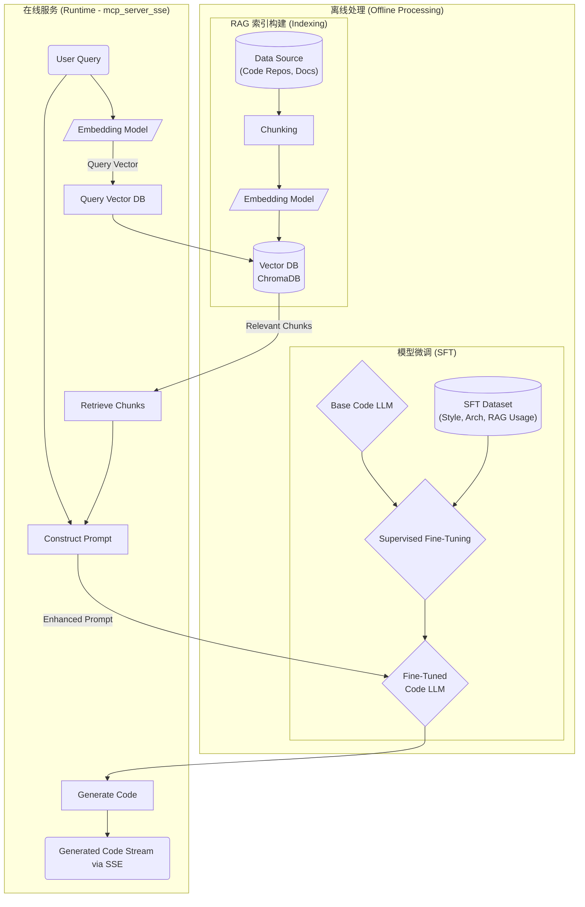

# Code Generator with MCP Integration

## 项目概述

本项目旨在构建一个企业级的 Python 代码生成器，利用大型语言模型 (LLMs)、检索增强生成 (RAG)、模型上下文协议 (MCP) 等技术，自动完成代码的编写、测试和部署。当前阶段实现了基于 RAG 的代码嵌入和语义搜索服务，并支持通过 MCP 协议进行通信。

该服务允许用户处理代码文件，将其转换为向量嵌入并存储到向量数据库中，然后基于语义相似度搜索相关代码。这使得开发者能够快速找到与特定功能或概念相关的代码片段，为后续的代码生成、补全或理解提供基础。

### 目标

1.  包含按步骤有序生成代码的框架 (进行中)
2.  包含集成历史代码的能力 (通过 RAG 实现)
3.  包含代码分级，用户分级的能力 (规划中)
4.  进一步扩展到需求整理，技术方案设计，代码生成与调试，代码运维与发布 (远期目标)

## 工作流



## 模型上下文协议 (MCP)

本项目使用模型上下文协议 (MCP) 进行客户端与服务器之间的交互。目前支持以下传输方式：

1.  **STDIO**（标准输入/输出）：使用标准输入和输出流进行通信，适合本地集成和命令行工具。
2.  **Streamable HTTP**: 使用 HTTP 长连接 (基于 Server-Sent Events) 和标准 HTTP 请求 (POST/DELETE) 进行双向流式通信，适合网络集成和 Web 应用。

*(原 SSE 版本已由 Streamable HTTP 替代)*

## 主要组件

1.  **Embedding Pipeline (`embedding/`)**: 核心功能实现，负责加载代码、使用 AST 或 Tree-sitter 进行解析和元数据提取、分割代码块、生成向量嵌入，并将其存储到 ChromaDB 向量数据库中。
2.  **RAG Service (`rag/`)**: 结合了 Retriever, ReRanker (可选), Prompt Builder 和 LLM Interface，用于处理用户查询，执行检索、重排序（可选），构建 Prompt，并与 LLM 交互以生成响应。
3.  **MCP 服务器 (`mcp/`)**: 将 Embedding Pipeline 和 RAG Service 的功能通过 MCP 协议暴露为服务。
    *   `mcp_server_stdio.py`: STDIO 传输版本。
    *   `mcp_server_streamablehttp.py`: Streamable HTTP 传输版本。
4.  **MCP 客户端 (`mcp/`)**: 用于连接 MCP 服务器并调用其工具。
    *   `mcp_client_stdio.py`: 连接 STDIO 服务器。
    *   `mcp_client_streamablehttp.py`: 连接 Streamable HTTP 服务器。
5.  **工具 (`utils/`)**: 提供日志设置等辅助功能。
6.  **配置 (`config.py`)**: 管理项目配置，如模型名称、API 密钥、持久化目录等。

## 安装依赖

需要 Python 3.10 或更高版本。

1.  **创建虚拟环境** (推荐):
    ```bash
    python -m venv .venv
    source .venv/bin/activate  # Linux/macOS
    # .\.venv\Scripts\activate  # Windows
    ```
2.  **安装依赖**:
    ```bash
    pip install -r requirements.txt
    ```
    主要依赖包括:
    *   `langchain`, `langchain_community`, `langchain_core`: RAG 流程核心库。
    *   `chromadb`: 向量数据库。
    *   `sentence-transformers`: 用于获取嵌入模型和 Cross-Encoder (ReRanker)。
    *   `tree-sitter`, `tree-sitter-languages`: 代码解析。
    *   `aiohttp`, `aiohttp-sse-client==0.2.1`: Streamable HTTP 传输依赖。
    *   `openai`, `python-dotenv`: LLM 交互和配置管理。
    *   `pytest`, `pytest-asyncio`: 测试框架。

## 使用方法

### Streamable HTTP 版本 (推荐)

#### 启动 Streamable HTTP 服务器

在项目根目录下运行 (确保 `.venv` 已激活):

```bash
python -m mcp.mcp_server_streamablehttp
```

服务器将在端口 8080 (默认) 上启动，等待客户端连接。

#### 使用 Streamable HTTP 客户端 (编程方式)

```python
import asyncio
from mcp.mcp_client_streamablehttp import StreamableHttpClient

async def main():
    SERVER_URL = "http://localhost:8080"
    TEST_COLLECTION_NAME = "my_code_project"
    # 示例文件路径 (请替换为实际路径)
    # file_paths = ["path/to/your/code.py", "path/to/another/file.py"]
    file_paths = ["embedding/storage/chroma.py", "mcp/transports/streamable_http_client_transport.py"]


    # 创建客户端
    client = StreamableHttpClient(SERVER_URL)

    try:
        # 连接并初始化
        capabilities = await client.initialize()
        print(f"连接成功！服务器能力: {capabilities}")

        # (可选) 清理旧集合
        print(f"尝试清理集合: {TEST_COLLECTION_NAME}")
        await client.delete_collection(TEST_COLLECTION_NAME)

        # 处理代码文件
        print(f"处理文件: {file_paths}")
        result = await client.process_files(file_paths, TEST_COLLECTION_NAME)
        print(f"处理结果: {result}")
        if result.get("status") != "success":
            print("文件处理失败，后续步骤可能无法正常工作。")
            return

        # 列出所有集合
        collections = await client.list_collections()
        print(f"当前集合列表: {collections}")

        # 获取集合信息
        info = await client.get_collection_info(TEST_COLLECTION_NAME)
        print(f"集合 '{TEST_COLLECTION_NAME}' 信息: {info}")

        # 搜索代码
        query = "how to send message via http post"
        print(f"搜索: '{query}'")
        search_results = await client.search_code(query, k=3, collection_name=TEST_COLLECTION_NAME)
        print(f"搜索结果数量: {len(search_results)}")
        for i, res in enumerate(search_results):
             print(f"  结果 {i+1}:")
             print(f"    Source: {res.get('metadata', {}).get('source')}")
             print(f"    Content: {res.get('content', '')[:150]}...") # 打印部分内容

    except ConnectionError as e:
        print(f"连接错误: {e}")
    except Exception as e:
        print(f"发生错误: {e}")
    finally:
        # 断开连接
        if client.is_connected:
            await client.close()
            print("连接已关闭。")

if __name__ == "__main__":
    asyncio.run(main())
```
*(注意: 上述客户端示例需要根据实际文件路径调整，并且需要 Streamable HTTP 服务器正在运行)*

### STDIO 版本 (本地/调试)

#### 启动 STDIO 服务器

```bash
python -m mcp.mcp_server_stdio
```

#### 使用 STDIO 客户端

```bash
python -m mcp.mcp_client_stdio
```
这将启动一个交互式界面。

## 功能详解 (MCP 工具)

服务器通过 MCP 协议暴露以下工具:

*   `initialize`: 初始化连接，返回服务器能力。
*   `process_files`: 处理代码文件 (解析、嵌入、存储)。
    *   参数: `file_paths` (List[str]), `collection_name` (str)
    *   返回: 处理结果 `Dict` (`status`, `message`, `file_count`, `chunk_count`, `collection_name`)
*   `search_code`: 语义搜索代码块。
    *   参数: `query` (str), `k` (int), `collection_name` (Optional[str])
    *   返回: 搜索结果列表 `List[Dict]` (每个包含 `content`, `metadata`)
*   `load_collection`: (主要由内部使用) 加载指定集合以供后续操作。
    *   参数: `collection_name` (Optional[str])
    *   返回: 加载状态 `Dict` (`status`, `message`)
*   `list_collections`: 列出所有可用的集合名称。
    *   参数: 无
    *   返回: `Dict` (`collections`: List[str])
*   `get_collection_info`: 获取特定集合的信息 (如文档数量)。
    *   参数: `collection_name` (str)
    *   返回: 集合信息 `Dict` (`name`, `count`, `persist_directory`, `error`?)
*   `delete_collection`: 删除指定的集合。
    *   参数: `collection_name` (str)
    *   返回: 操作状态 `Dict` (`status`, `message`)

## 实现特点

1.  **异步设计**: 全链路使用 `asyncio` 提高并发处理能力。
2.  **MCP 协议**: 使用标准化的 MCP 协议进行客户端/服务器通信。
3.  **Streamable HTTP**: 支持流式、长连接的 HTTP 传输。
4.  **模块化**: 清晰的模块划分 (embedding, rag, mcp, transports, utils)。
5.  **RAG 流程**:
    *   使用 `ChromaDB` 作为向量存储。
    *   支持 `sentence-transformers` 加载嵌入模型。
    *   集成 **ReRanker** (基于 `sentence-transformers` CrossEncoder) 对检索结果进行重排序 (可选，通过配置启用)。
    *   支持从配置加载不同 LLM (当前主要是 OpenAI)。
    *   **上下文管理**: RAG 服务会根据 LLM 的上下文窗口大小自动截断输入文档块，防止超长。
6.  **代码解析**: 使用 `tree-sitter` 进行代码解析和块分割。
7.  **配置驱动**: 通过 `config.py` 和 `.env` 文件管理配置。
8.  **类型提示**: 广泛使用类型提示提高代码质量。
9.  **测试**: 包含使用 `pytest` 和 `pytest-asyncio` 的集成测试。

## 测试结果

| 实现                     | 状态       | 备注                                               |
| ------------------------ | ---------- | -------------------------------------------------- |
| Embedding Pipeline       | ✅ 基本可用 | 需要进一步优化元数据提取和关联                |
| RAG Service              | ✅ 基本可用 | 集成了 ReRanker 和上下文截断                     |
| MCP STDIO Server         | ✅ 可运行   | 功能与 Streamable HTTP 版本同步可能略有延迟 |
| MCP STDIO Client         | ✅ 可运行   | 功能与 Streamable HTTP 版本同步可能略有延迟 |
| MCP Streamable HTTP Server | ✅ 正常工作 | 通过 `test_embed_pipeline.py` 测试             |
| MCP Streamable HTTP Client | ✅ 正常工作 | 通过 `